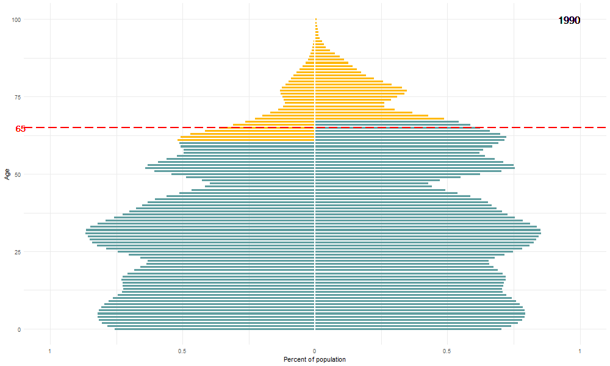

# Prospective Ageing - Talk 

This is the repo for an informal seminar I gave at the Oxford Institute of Population Ageing 21.11.2018. 

It includes my first attempts at using [gganimate](https://github.com/thomasp85/gganimate) to animate the charts and [xarinang](https://github.com/yihui/xaringan) to make the slides. 

## Prospective Ageing

The talk is a descriptive one on what Prospective Age is, following Sanderson and Scherbov and what they call the [*Characteristics Approach to Population Ageing: New Measures*](http://www.iiasa.ac.at/web/home/research/researchPrograms/WorldPopulation/Reaging/Indicators.html). I then used the 10 countries represented in my audience to demonstrate the difference between restrospective and prospective measures of ageing. 

## Data

The data used here is sourced directly from the [Prospective Age Dataset](https://figshare.com/articles/Prospective_Age_Dataset/6974414) figshare deposit, which I prepared in this [github repository](https://github.com/majazaloznik/ProspectiveAgeData). The underlying data is the 2017 Revision of the UN World Population Prospects. 

## The gifs...

...are the best bit. 

Here, for example, is the old age threshold---age at which the remaining life expectancy is 15 years---in Belarus 1980 to 2050. The lines in the background are the other nine *specially selected countries* (China, Georgia, Japan, Italy, South Korea, UK, USA, Spain & Slovenia).

And here is the Belarussian population pyramid with the people with a remaining life expectancy of 15 years or less highlighted in yellow. This is for 1990-2040. 

And finally, to mix it up a bit, here's how Japan's proportion of the population over 65 compares to the proportion of the population over the $RLE_{15}$ threhsold i.e. the proportion of people who have fewer than 15 years to live. 

## The actual presentation

Deployed on [github pages here](https://majazaloznik.github.io/2018-prospective_ageing_talk/presentations/2018-propsective_ageing_talk.html#1).

## Authors

*Maja Z*

## Acknowledgments

* Hat tip Sanderson and Scherbov for their amazing work!