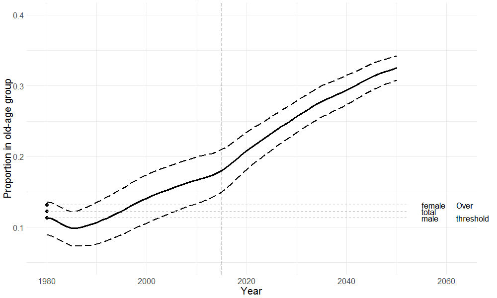

# Outline


--
1. What is population ageing?


--
1. What is *prospective age*?


--
3. Bring it home

---

### Slovenia: Old-age threshold

```{r echo = FALSE}

```

---

### Slovenia: Proportion "old"

```{r echo = FALSE}

```

---

### Slovenia 

```{r echo = FALSE}

```

---

### Belarus 

```{r echo = FALSE}
knitr::include_graphics("figures/Belarus.gif")
```

---
### China

```{r echo = FALSE}
knitr::include_graphics("figures/China.gif")
```
---

### Georgia

```{r echo = FALSE}
knitr::include_graphics("figures/Georgia.gif")
```

---
### Italy 

```{r echo = FALSE}
knitr::include_graphics("figures/Italy.gif")
```

---
 
### Japan

```{r echo = FALSE}
knitr::include_graphics("figures/Japan.gif")
```

---
### Korea

```{r echo = FALSE}
knitr::include_graphics("figures/Republic of Korea.gif")
```

---
### Spain

```{r echo = FALSE}
knitr::include_graphics("figures/Spain.gif")
```

---
### United Kingdom

```{r echo = FALSE}
knitr::include_graphics("figures/United Kingdom.gif")
```

---
### United States of America

```{r echo = FALSE}
knitr::include_graphics("figures/United States of America.gif")
```
